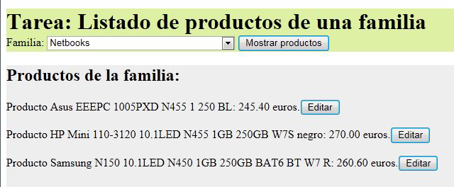

# Tareas_DWES_DAW
Taeras del Módulo de Entorno servidor del Grado Superior de DAW
## Contenidos
  - [Tarea DWES01](#DWES01)
  - [Tarea DWES02](#DWES02)
  - [Tarea DWES03](#DWES03)
  - [Tarea DWES04](#DWES04)
  - [Tarea DWES05](#DWES05)
  - [Tarea DWES06](#DWES06)
  - [Tarea DWES07](#DWES07)

## DWES01

__Enunciado__
 
Quieres programar una aplicación web para gestionar una lista de direcciones de correo. En una primera aproximación, tu aplicación se compondrá de tres páginas:

 - Una página de presentación, donde explicas el cometido de la aplicación y su funcionamiento. Contiene un enlace que te lleva a la siguiente página.
 - Una página de introducción de datos, donde cualquiera puede darse de alta introduciendo su nombre y su dirección de correo. Contiene un formulario que, una vez rellenado, envía los datos y te lleva a la siguiente página.
 - Una página de visualización de datos, en la que se muestra la lista, nombres y direcciones de correo, de todos los que se han anotado en la aplicación.

Tienes que crear un documento en el que respondas a las siguientes preguntas sobre la aplicación que vas a desarrollar:
 - ¿Qué tipo de páginas, estáticas o dinámicas, utilizarás para programar cada una de las páginas que componen tu aplicación? ¿Por qué?
 - Si en la página de introducción de datos quieres comprobar, antes de enviar los datos, que el correo electrónico introducido cumple unas ciertas normas (por ejemplo, que tiene una @), ¿qué tecnología/lenguaje utilizarás?
 - Si en esa misma página, ahora quieres comprobar que el correo electrónico introducido no se haya introducido anteriormente y ya figure en la lista, ¿qué tecnología/lenguaje utilizarás?
 - ¿Qué arquitecturas puedes usar en el servidor para ejecutar la aplicación? ¿Cómo es el o los lenguajes que se usa en cada una de esas arquitecturas: de guiones, compilado a código nativo o compilado a código intermedio?
 - ¿Qué parámetros debes tener en cuenta para decidirte por usar una arquitectura u otra?
 - Si te decides por utilizar una arquitectura AMP para la aplicación ¿qué componentes necesitas instalar en tu servidor para ejecutar la aplicación? Indica algún producto concreto para cada componente.
 - ¿Qué necesitas instalar en tu ordenador para poder desarrollar la aplicación?
 - Si utilizas el lenguaje PHP para programar la aplicación, ¿cuál será el tipo de datos se utilizará para manipular cada una de las direcciones de correo?

__Consejos y recomendaciones__

Incluye la pregunta que se formula antes de cada una de las respuestas.
No respondas de forma demasiado breve. Intenta razonar y explicar de forma clara las decisiones adoptadas.
Si consideras que existen varias respuestas posibles, indícalo y explica cuál sería la mejor opción.

## DWES02

__Enunciado__

Debes programar una aplicación para mantener una pequeña agenda en una única página web programada en PHP.

La agenda almacenará únicamente dos datos de cada persona: su nombre y un número de teléfono. Además, no podrá haber nombres repetidos en la agenda.

En la parte superior de la página web se mostrará el contenido de la agenda. En la parte inferior debe figurar un sencillo formulario con dos cuadros de texto, uno para el nombre y otro para el número de teléfono.

Cada vez que se envíe el formulario:
  - Si el nombre está vacío, se mostrará una advertencia.
  - Si el nombre que se introdujo no existe en la agenda, y el número de teléfono no está vacío, se añadirá a la agenda.
  - Si el nombre que se introdujo ya existe en la agenda y se indica un número de teléfono, se sustituirá el número de teléfono anterior.
  - Si el nombre que se introdujo ya existe en la agenda y no se indica número de teléfono, se eliminará de la agenda la entrada correspondiente a ese nombre.

__Recursos necesarios para realizar la Tarea__

Ordenador con PHP, servidor web Apache y entorno de desarrollo, correctamente instalado y configurado. 

En mi caso usé XAMPP y Visual Studio Code.

__Consejos y recomendaciones.__

Se recomienda emplear como apoyo en el desarrollo del examen un navegador con acceso a Internet, para poder consultar el manual online de PHP.

## DWES03

__Enunciado__

Partiendo de la base de datos 'dwes' usada en los ejemplos y ejercicios de la unidad, se trata de programar una aplicación que permita gestionar los registros de la tabla 'productos'. La aplicación se dividirá en tres páginas web:

  - __listado.php__. Mostrara un cuadro desplegable que permita seleccionar un registro de la tabla 'familias', junto a un botón "Mostrar". Al pulsar el botón, se mostrará un listado de los productos de la familia seleccionada.

   Para cada producto se mostrará su nombre corto y su PVP, junto a un botón con el texto "Editar" (una opción es crear un formulario distinto por cada producto). Cuando se pulse ese botón, se enviará el formulario a la página "editar.php".

   

   

   

