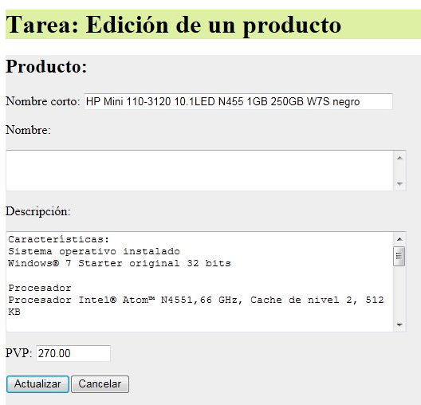
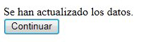
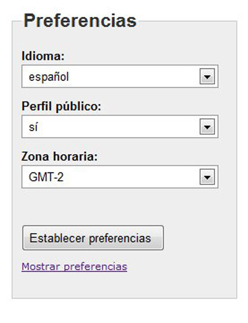
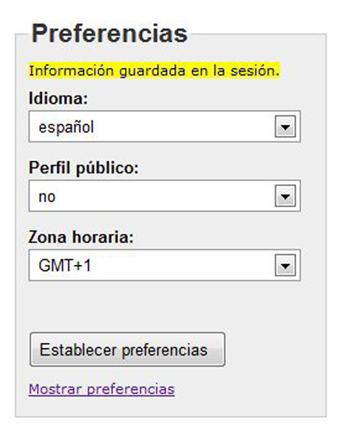
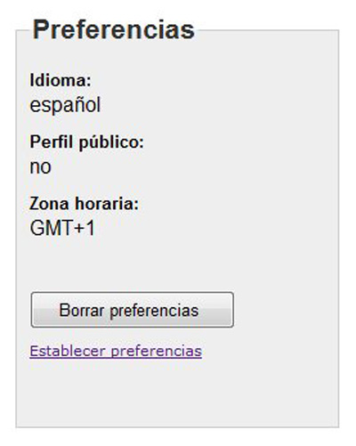
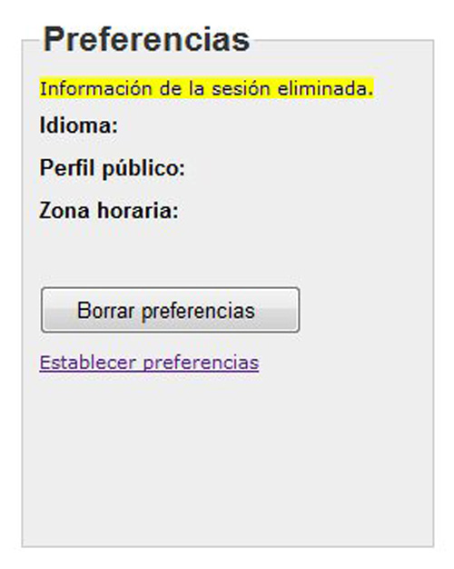
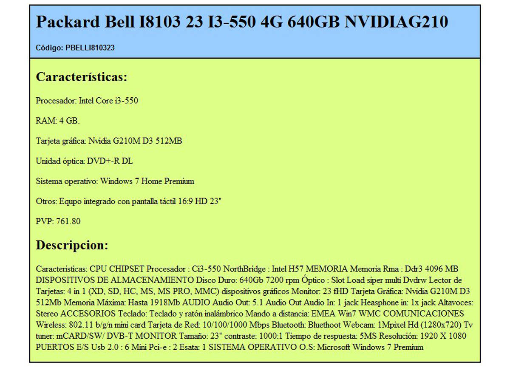
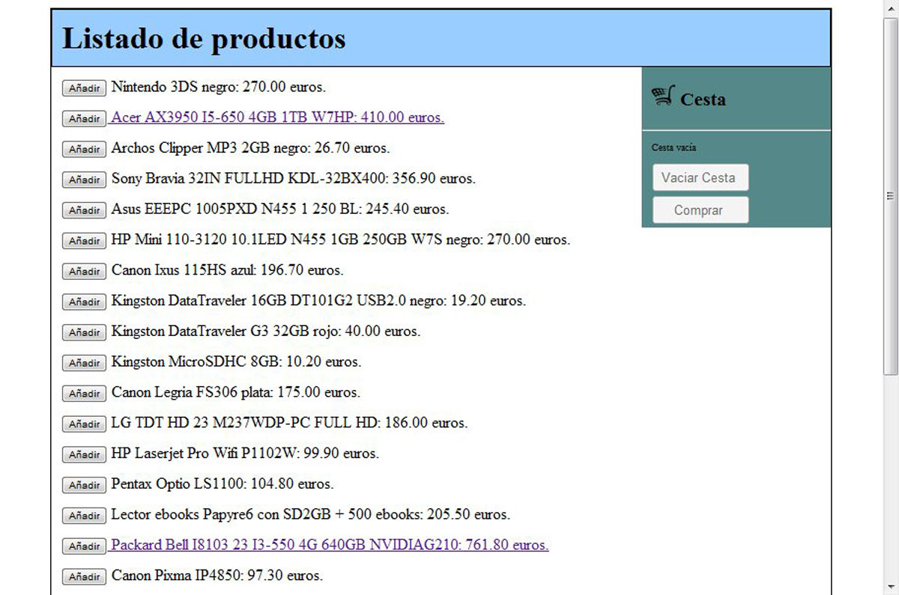

# Tareas_DWES_DAW
Taeras del Módulo de Entorno servidor del Grado Superior de DAW
## Contenidos
  - [Tarea DWES01](#DWES01)
  - [Tarea DWES02](#DWES02)
  - [Tarea DWES03](#DWES03)
  - [Tarea DWES04](#DWES04)
  - [Tarea DWES05](#DWES05)
  - [Tarea DWES06](#DWES06)
  - [Tarea DWES07](#DWES07)

## DWES01

__Enunciado__
 
Quieres programar una aplicación web para gestionar una lista de direcciones de correo. En una primera aproximación, tu aplicación se compondrá de tres páginas:

 - Una página de presentación, donde explicas el cometido de la aplicación y su funcionamiento. Contiene un enlace que te lleva a la siguiente página.
 - Una página de introducción de datos, donde cualquiera puede darse de alta introduciendo su nombre y su dirección de correo. Contiene un formulario que, una vez rellenado, envía los datos y te lleva a la siguiente página.
 - Una página de visualización de datos, en la que se muestra la lista, nombres y direcciones de correo, de todos los que se han anotado en la aplicación.

Tienes que crear un documento en el que respondas a las siguientes preguntas sobre la aplicación que vas a desarrollar:
 - ¿Qué tipo de páginas, estáticas o dinámicas, utilizarás para programar cada una de las páginas que componen tu aplicación? ¿Por qué?
 - Si en la página de introducción de datos quieres comprobar, antes de enviar los datos, que el correo electrónico introducido cumple unas ciertas normas (por ejemplo, que tiene una @), ¿qué tecnología/lenguaje utilizarás?
 - Si en esa misma página, ahora quieres comprobar que el correo electrónico introducido no se haya introducido anteriormente y ya figure en la lista, ¿qué tecnología/lenguaje utilizarás?
 - ¿Qué arquitecturas puedes usar en el servidor para ejecutar la aplicación? ¿Cómo es el o los lenguajes que se usa en cada una de esas arquitecturas: de guiones, compilado a código nativo o compilado a código intermedio?
 - ¿Qué parámetros debes tener en cuenta para decidirte por usar una arquitectura u otra?
 - Si te decides por utilizar una arquitectura AMP para la aplicación ¿qué componentes necesitas instalar en tu servidor para ejecutar la aplicación? Indica algún producto concreto para cada componente.
 - ¿Qué necesitas instalar en tu ordenador para poder desarrollar la aplicación?
 - Si utilizas el lenguaje PHP para programar la aplicación, ¿cuál será el tipo de datos se utilizará para manipular cada una de las direcciones de correo?

__Consejos y recomendaciones__

Incluye la pregunta que se formula antes de cada una de las respuestas.
No respondas de forma demasiado breve. Intenta razonar y explicar de forma clara las decisiones adoptadas.
Si consideras que existen varias respuestas posibles, indícalo y explica cuál sería la mejor opción.

## DWES02

__Enunciado__

Debes programar una aplicación para mantener una pequeña agenda en una única página web programada en PHP.

La agenda almacenará únicamente dos datos de cada persona: su nombre y un número de teléfono. Además, no podrá haber nombres repetidos en la agenda.

En la parte superior de la página web se mostrará el contenido de la agenda. En la parte inferior debe figurar un sencillo formulario con dos cuadros de texto, uno para el nombre y otro para el número de teléfono.

Cada vez que se envíe el formulario:
  - Si el nombre está vacío, se mostrará una advertencia.
  - Si el nombre que se introdujo no existe en la agenda, y el número de teléfono no está vacío, se añadirá a la agenda.
  - Si el nombre que se introdujo ya existe en la agenda y se indica un número de teléfono, se sustituirá el número de teléfono anterior.
  - Si el nombre que se introdujo ya existe en la agenda y no se indica número de teléfono, se eliminará de la agenda la entrada correspondiente a ese nombre.

__Recursos necesarios para realizar la Tarea__

Ordenador con PHP, servidor web Apache y entorno de desarrollo, correctamente instalado y configurado. 

En mi caso usé XAMPP y Visual Studio Code.

__Consejos y recomendaciones.__

Se recomienda emplear como apoyo en el desarrollo del examen un navegador con acceso a Internet, para poder consultar el manual online de PHP.

## DWES03

__Enunciado__

Partiendo de la base de datos 'dwes' usada en los ejemplos y ejercicios de la unidad, se trata de programar una aplicación que permita gestionar los registros de la tabla 'productos'. La aplicación se dividirá en tres páginas web:

  - __listado.php__. Mostrara un cuadro desplegable que permita seleccionar un registro de la tabla 'familias', junto a un botón "Mostrar". Al pulsar el botón, se mostrará un listado de los productos de la familia seleccionada.

   Para cada producto se mostrará su nombre corto y su PVP, junto a un botón con el texto "Editar" (una opción es crear un formulario distinto por cada producto). Cuando se pulse ese botón, se enviará el formulario a la página "editar.php".

   

   - __editar.php__. Debe mostrar los datos del producto seleccionado en la página anterior (nombre corto, nombre, descripción y PVP) dentro de un formulario que permita cambiarlos, y dos botones: "Actualizar" y "Cancelar". El formulario se enviará a la página "actualizar.php". 

 

 - __actualizar.php__. Esta página simplemente redirige a la página "listado.php", pero si en el formulario anterior se ha pulsado "Actualizar" (y no "Cancelar"), antes de redirigir debe ejecutar una consulta para cambiar los datos del producto. Para redirigir se puede utilizar un formulario con un botón "Continuar" o la etiqueta "<meta http-equiv='refresh' content='1'; url=…>" dentro del encabezado. 

 

 Para acceder a la base de datos se debe usar PDO. También se deben utilizar excepciones para el control de errores. Además, se recomienda utilizar como base esta página y hoja de estilo.

 [Página y hoja de estilo](https://aulavirtual35.educa.madrid.org/ies.lapaloma.madrid/pluginfile.php/124288/mod_assign/intro/DWES03/DWES03_recursos_tarea/DWES03_TAR_R04_plantillas.zip). (0.01 MB)

 __Criterios de puntuación.__

Se valorará con dos puntos la consecución de cada uno de los siguientes ítems:
  - En listado.php, generar el listado de los productos de cada familia.
  - En editar.php, generar el formulario de edición del producto.
  - En actualizar.php, realizar la consulta de actualización de datos y la redirección a listado.php.

Se valorará con un punto la consecución de cada uno de los siguientes ítems:
  - Generar el cuadro desplegable con la lista de las familias en listado.php.
  - Mantenimiento de la información entre las tres páginas de la tarea.
  - Utilizar excepciones para el control de los posibles errores.
  - Introducir comentarios y legibilidad del código.

 ## DWES04

__Enunciado__

Tienes que programar una aplicación web sencilla que permita gestionar una serie de preferencias del usuario. La aplicación se dividirá en dos páginas:

  - __preferencias.php__. Permitirá al usuario escoger sus preferencias y las almacenará en la sesión del usuario.

   

  Mostrará un cuadro desplegable por cada una de las preferencias. Estas serán:
  - Idioma. El usuario podrá escoger un idioma entre "inglés" y "español".
  - Perfil público. Sus posibles opciones será "sí" y "no".
  - Zona horaria. Los valores en este caso estarán limitados a "GMT-2", "GMT-1", "GMT", "GMT+1" y "GMT+2".

  Además en la parte inferior tendrá un botón con el texto "Establecer preferencias" y un enlace que ponga "Mostrar preferencias".

  El botón almacenará las preferencias en la sesión del usuario y volverá a cargar esta misma página, en la que se mostrará el texto "Información guardada en la sesión".
  Una vez establecidas esas preferencias, deben estar seleccionadas como valores por defecto en los tres cuadros desplegables.

  

  El enlace llevará a la página mostrar.php.

  - __mostrar.php__. Debe mostrar un texto con las preferencias que se encuentran almacenadas en la sesión del usuario. Además, en la parte inferior tendrá un botón con el texto "Borrar preferencias" y un enlace que ponga "Establecer preferencias".

  

  El botón borrará las preferencias de la sesión del usuario y volverá a cargar esta misma página, en la que se mostrará el texto "Información de la sesión eliminada". Una vez borradas esas preferencias, se debe comprobar que sus valores no se muestran  en el texto de la página.

   

  El enlace llevará a la página preferencias.php.
  Se adjunta una hoja de estilos para usar en las páginas que se programen.
  [Hoja de estilo](https://aulavirtual35.educa.madrid.org/ies.lapaloma.madrid/pluginfile.php/124289/mod_assign/intro/DWES04/DWES04_RecursosTarea/DWES04_TAR_R05_tarea.zip) (2.00 KB)

__Criterios de puntuación. Total 10 puntos.__

Se valorará con dos puntos la consecución de cada uno de los siguientes ítems:

  - En preferencias.php, recoger los valores enviados por el formulario y almacenarlos en la sesión del usuario.
  - En mostrar.php, mostrar las preferencias del usuario según figuran en los valores de la sesión.
    
Se valorará con un punto la consecución de cada uno de los siguientes ítems:

  - En preferencias.php, establecer las preferencias seleccionadas por el usuario como valores por defecto en los cuadros de selección.
  - En mostrar.php, eliminar las preferencias almacenadas en la sesión del usuario cuando se indica.
  - Realizar las dos páginas con los elementos HTML indicados, incluyendo etiquetas, formularios, cuadros de selección, botones y enlaces.
  - Vincular los elementos de cada una de las páginas con los estilos que se adjuntan en la hoja tarea.css.
  - Iniciar y restablecer correctamente las sesiones en las dos páginas.
  - Introducir comentarios y estructurar el código.

 ## DWES05

__Enunciado__

En esta ocasión debes ampliar ligeramente la funcionalidad de la última versión con la que hemos trabajado de la tienda online. Se precisa mostrar a los usuarios de la tienda información más detallada sobre los productos de la misma, y se ha decidido comenzar por los ordenadores.

El objetivo es crear una nueva página que muestre información sobre un modelo de ordenador. Esta información se almacenará en una nueva tabla de la base de datos. En el listado de productos, se incluirá un enlace en aquellos que sean de tipo Ordenador, para dar acceso a la nueva información.

Los pasos que has de seguir son:

  - Crear una base de datos de nombre "tarea5", similar a la que usamos en los ejercicios de la tienda web. Se te proporciona un guion de comandos SQL para crear su estructura y añadir los datos correspondientes. Para acceder se usan las credenciales habituales: usuario "dwes" y contraseña "abc123.".

     [Guion de comandos SQL base de datos 'tarea5'](https://aulavirtual35.educa.madrid.org/ies.lapaloma.madrid/pluginfile.php/124290/mod_assign/intro/DWES05/DWES05_RecursosTarea/DWES05_TAR_R01_Crear_BD_tarea5.zip) (9 KB)
    
  - Incluir la nueva tabla "ordenador" en la base de datos. También se te proporciona un guion de comandos SQL para ejecutar sobre la base de datos "tarea5" que creaste en el punto anterior; el guión crea la estructura de la nueva tabla y le añade algunos datos, correspondientes a los ordenadores existentes.
    
    [Guion de comandos SQL tabla 'ordenador'](https://aulavirtual35.educa.madrid.org/ies.lapaloma.madrid/pluginfile.php/124290/mod_assign/intro/DWES05/DWES05_RecursosTarea/DWES05_TAR_R02_Crear_tabla_ordenador.zip)  (2 KB)

  - Descargar, instalar y configurar el motor de plantillas [Smarty.](https://www.smarty.net/)
  - Utilizando el código de la tienda web que se aporta, instalarla y comprobar su correcto funcionamiento.

    [Código de la tienda web que se aporta](https://aulavirtual35.educa.madrid.org/ies.lapaloma.madrid/pluginfile.php/124290/mod_assign/intro/DWES05/DWES05_RecursosTarea/DWES05_TAR_R03_Tienda_web.zip)  (9 KB)

  - Sobre la tienda web, crear una nueva clase para manejar la información correspondiente a cada ordenador.

  - Utilizando Smarty, crear una nueva página en PHP, con su correspondiente plantilla, para mostrar la información de un modelo de ordenador. Se debe mostrar: nombre corto, código, procesador, RAM, tarjeta gráfica, unidad óptica, otros, PVP y descripción (ten en cuenta que algunos datos están almacenados en la tabla producto). Fíjate en la imagen de la página resultante que se aporta (no es necesario que el aspecto estético resultante sea igual).

    

  - Modificar la página productos.php / productos.tpl para convertir los nombres de los productos de tipo ordenador en enlaces a la página anterior. Cuando el usuario pinche en uno de esos enlaces, se le abrirá la nueva página, con la información del modelo de ordenador seleccionado.

    

  Se pueden realizar cuantos cambios sean necesarios en el código que se entrega, mientras se mantenga la separación entre la lógica de presentación y la lógica de negocio.

__Criterios de puntuación. Total 10 puntos.__

Se valorará con un punto la consecución de cada uno de los siguientes ítems:
  - Crear la base de datos y añadir la tabla ordenador.
  - Descargar, instalar y configurar correctamente el motor de plantillas Smarty.
  - Poner en funcionamiento la tienda online utilizando el código que se aporta.
  - Modificar las clases existentes para añadirles las funcionalidades necesarias.
Se valorará con un punto la consecución de cada uno de los siguientes ítems:
  - Crear la clase Ordenador, con los miembros que correspondan.
  - Crear la nueva página y su plantilla, para mostrar el detalle de cada modelo de ordenador.
  - Modificar el listado de productos para añadir los enlaces a la nueva página con el detalle de los ordenadores

   ## DWES06

__Enunciado__

Vamos a seguir utilizando para esta tarea la base de datos correspondiente a la tienda web.

En primer lugar deberás utilizar el guion de comandos SQL suministrado en el tema 3 para crear una base de datos de nombre "dwes", como la que usamos en los ejercicios anteriores. Para acceder se usan las credenciales habituales: usuario "dwes" y contraseña "abc123.".

A continuación utilizarás PHP8 SOAP para crear un servicio web con cuatro funciones que expongan información de la base de datos de la tienda online. De momento no deberás utilizar WSDL. Las funciones son las siguientes:

  - __getPVP__. Esta función recibirá como parámetro el código de un producto, y devolverá el PVP correspondiente al mismo.
  - __getStock__. Esta función recibirá dos parámetros: el código de un producto y el código de una tienda. Devolverá el stock existente en dicha tienda del producto.
  - __getFamilias__. No recibe parámetros y devuelve un array con los códigos de todas las familias existentes.
  - __getProductosFamilia__. Recibe como parámetro el código de una familia y devuelve un array con los códigos de todos los productos de esa familia.

    

